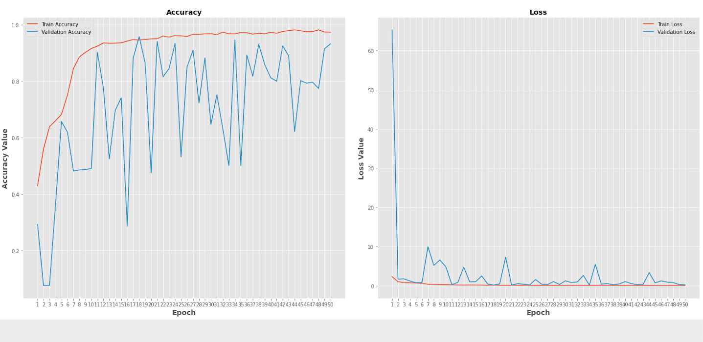

**Important note**
You can find all codes and jupyter notebook files in each model's folder

# Covid-19-detection-with-chest-scan
This repo contains covid-19 detection with three algorithms , CNN , ResNet 50  and VGG 16 . out of which I got best accuracy with vgg16 as 98.8%

* •	Dataset of chest X-ray is downloaded from Kaggle.com and it is visualised for the proper understanding of the data before processing. Data augmentation is applied on the images so that it can effectively classify the covid-19 cases.
* •	CNN is proposed for the detection of covid-19 and hence controls the fast spreading covid-19 cases.
* •	Pre trained deep learning model that is transfer learning algorithm VGG-16 is used to increase the accuracy of the proposed model

**Sample Dataset Image**

# CNN model

**CNN ACCURACY CURVE**

**CNN Confusion Matrics**

**CNN ROC**

# ResNet50 model

**ResNet50 ACCURACY CURVE**

**ResNet50 Confusion Matrics**

**ResNet50 ROC**

# VGG16 model

**VGG16 ACCURACY CURVE**

**VGG16 Confusion Matrics**

**VGG16 ROC**

**Accuracy comarision table**

**Accuracy Comparision graphs**

